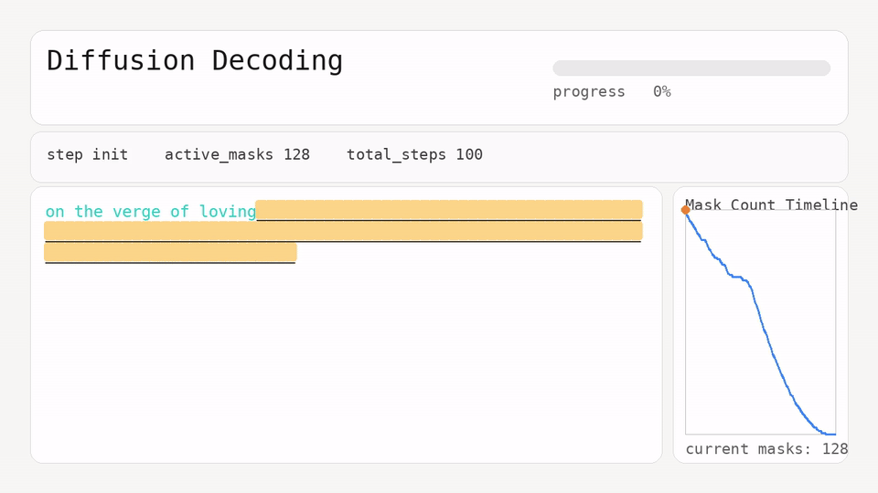

# micro-dllm

This repo trains a micro-dLLM(~10.7M) based on [mercury's training and inference](https://arxiv.org/abs/2506.17298) approach over characters and generates text with iterative denoising.


[](./diffusion_trace.mp4)


## What This Implements

- Forward corruption with `[MASK]` tokens over random timesteps `t in [1..T]`
- Time-conditioned Transformer denoiser (`timestep_emb`)
- Full-sequence denoising objective (predict clean `x0` from noisy `x_t`)
- Reverse denoising at inference (`t = T -> 1`, plus final `t=0` pass)
- Confidence-based remasking for iterative refinement
- MP4 trace output for denoising steps

## Architecture Details

- Tokenization: character-level vocabulary from `data.txt` + `_` mask token
- Context length: `block_size = 256` characters
- Diffusion steps: `T = 100`
- Layers: `n_layer = 6`
- Attention heads: `n_head = 6`
- Embedding dimension: `n_embd = 384`
- Head dimension: `head_dim = 64`
- Parameters: `10,706,304` (~`10.71M`, with current `vocab_size = 66`)
- Attention type: bidirectional (`is_causal=False`)
- Positional scheme: RoPE (precomputed rotary cos/sin buffers)
- Normalization: RMSNorm via `F.rms_norm`
- MLP: expansion `4 * n_embd` with `relu(x)^2` nonlinearity
- Timestep conditioning: learned embedding `Embedding(T + 1, n_embd)`

Training setup:

- Batch size: `64`
- Max iterations: `5000`
- Optimizer: `AdamW`
- Learning rate: `3e-4`
- Forward noising: cosine survival schedule  
  `a_t = cos((t / T) * pi / 2)`
- Objective: predict full clean sequence `x0` from noisy `xt` (cross-entropy over all positions)

Inference setup:

- Reverse denoising loop: `t = T -> 1`
- Per-step decoding: multinomial sampling (`temperature > 0`) or greedy (`temperature = 0`)
- Iterative refinement: low-confidence generated tokens are re-masked each step
- Final explicit denoise at `t=0` with greedy selection
- Visualization outputs: MP4 timeline of decoding steps


## Project Files

- `train.py`: model + training + periodic/final checkpoint saving
- `inference.py`: checkpoint loading, generation from prompt, MP4 trace export
- `data.txt`: training corpus

## Setup

Requirements:

- Python 3
- `torch`
- `Pillow` (for frame rendering)
- `ffmpeg` (for MP4 export)

## Training

```bash
python3 data.py --num-stories 100 --output data.txt
python3 train.py
```

Checkpoints are saved to `model.pt` during training and at the end.

## Inference + Visualizer

```bash
python3 inference.py \
  --checkpoint model_stories.pt \
  --prompt "Once upon a time" \
  --gen-len 256 \
  --temperature 1.0 \
  --viz-video diffusion_trace.mp4 \
  --trace-every 1 \
  --gif-frame-ms 180
```

## TinyStories Dataset Prep

Use `data.py` to stream TinyStories from Hugging Face and build a small local subset for laptop training:

```bash
python3 data.py \
  --dataset roneneldan/TinyStories \
  --split train \
  --num-stories 100 \
  --seed 1337 \
  --output data.txt
```

Notes:

- `--num-stories 100` or `--num-stories 200` is a good range for quick local runs.
- Sampling uses streaming + shuffle buffer, so it does not download the full dataset at once.
- `train.py` and `inference.py` automatically use the generated `data.txt`.


## Practical Next Improvements/Experiments

- [ ] Add resume training from checkpoint (`--resume model.pt`)
- [x] Train on 100-200 Tiny Stories
- [ ] Do loss curve ablations with gpt2 config for arm vs dif on 100-200 tiny stories
- [ ] Muon Ablations
- [ ] Train on SynTH/fineweb-edu
- [ ] Try speed running for a 200M+ param model
